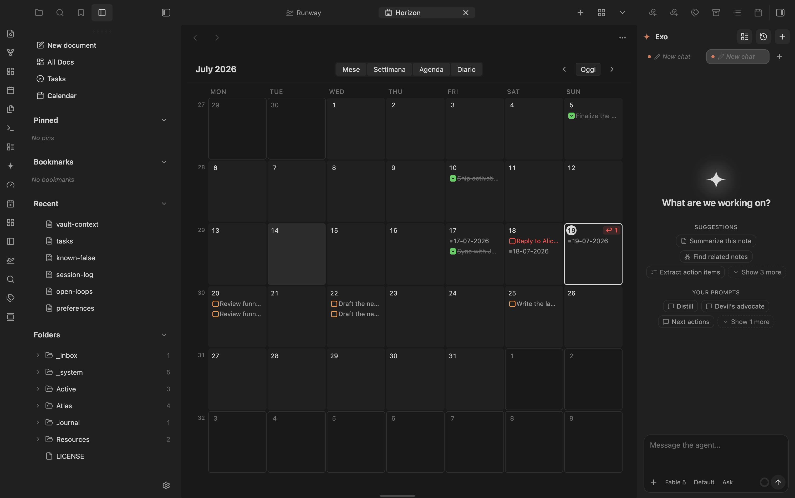

# Horizon

Calendar for your Obsidian vault: daily and periodic notes, tasks, and dated notes in one place.

Part of the marioverse Obsidian plugin suite.

<p align="center">
  
</p>
<p align="center"><em>The month grid, with daily notes and due tasks shown right on their date.</em></p>

## Views

- **Sidebar mini calendar** — month at a glance with content dots: daily note (accent), due tasks (orange), overdue (red), scheduled (cyan), done (green), dated notes (gray). ISO week numbers open weekly notes.
- **Calendar tab** (ribbon icon or `Horizon: Apri il calendario`) with three modes:
  - **Mese** — 7-column grid with content chips per day; "+N altri" jumps to the week view
  - **Settimana** — seven full-height columns, every chip visible
  - **Agenda** — chronological list of the upcoming days that have content
  - **Diario** — a text-first feed of existing daily notes, newest first, with expandable previews

## Data sources

1. **Daily / weekly / monthly / yearly notes** — existence resolved live from the per-period folder + filename format configured in settings (monthly/yearly are off by default)
2. **Tasks** with obsidian-tasks-plugin emoji dates: 📅 due, ⏳ scheduled, ✅ done. Cancelled tasks (status `-`) are hidden
3. **Notes with a `date` frontmatter property** (periodic notes are excluded to avoid duplicates)

## Rich mini-cards

Notes in Agenda, Week, the day popover, and Bases views render as **mini-cards**: title (with time), a clean two-line excerpt, and the note's cover image (frontmatter `cover`/`image`/`thumbnail` → first embed → first external image). Hydration is async and LRU-cached. In the compact Month grid, hovering a note chip shows a floating **hover-card** with image and a longer excerpt. Settings: card length slider and a `richCards` toggle to fall back to compact chips.

## Overdue triage

Open overdue tasks roll up to a pinned **"In ritardo"** section on today in the Agenda (with a batch "Porta tutto a oggi"), and today's cell shows a red `↩ N` badge in every view. Right-click any task chip for **snooze presets** (Oggi / Domani / Lunedì prossimo / +1 settimana). Every reschedule Notice carries a 10-second **Annulla** that re-applies the old date through the same guarded writes.

## Bases view

Horizon registers as a **Bases view**: any `.base` gains a month calendar. The Base decides *which* notes (filters); the view option `dateProperty` decides *when* (default `date` — set it to `created` for Granola meeting notes). Timestamps with an explicit offset (Granola writes UTC `Z`) are converted to the local day and time.

## Template tokens

Beyond `{{title}}` / `{{date:FMT}}` / `{{time:FMT}}`, periodic-note templates can use:

- `{{agenda}}` — the target day's meetings (with times) and open tasks, as plain bullets with source links (never `- [ ]` lines: no task duplication)
- `{{week-digest}}` — pre-compiled weekly review: *Fatto* (done per day), *Meeting e note*, *In arrivo* (due next week).

## Agents

`(app.plugins.getPlugin('horizon') as HorizonPlugin).api` exposes: `getAgenda(from, to)`, `getOverdue()`, `rescheduleTask(ref, kind, day)`, `toggleTaskDone(ref)`, `exportAgenda()`, `propose(proposal)`. Reads come from the live index; writes go through the guarded line-edit path.

- **Agenda export** — disabled by default; when enabled, writes to the configurable `.horizon/agenda.json` path at most every 5 minutes of activity.
- **Ghost proposals** — agents append to the configurable `.horizon/proposals.json` path (`kind: 'reschedule' | 'new-task'`, `targetKey`, optional `reason`). Horizon renders dashed ✦ ghost chips on the target days; ✓ accepts, ✕ dismisses.

## Interactions

- Click a day (or its number in the tab view) → open the daily note, creating it from the template when missing ({{title}}, {{date:FMT}}, {{time:FMT}} tokens fill against the target day). Mod-click opens in a new tab
- Click a week number → open/create the weekly note
- Hover a day with a note → native page preview
- **Checkbox on a task chip** → toggle done with a `✅` date, Tasks-plugin compatible. Recurring (🔁) tasks open at the line instead — completing them needs the Tasks rrule engine
- **Drag a task chip onto another day** (any view, including the sidebar) → its date field is rewritten in the source file. Writes are guarded: exact text at the expected line, unique-match fallback, abort on ambiguity

## Notes

- Replaces the community **Calendar** plugin — disable it manually to avoid two sidebar calendars
- The stale Periodic Notes config is ignored on purpose; Horizon keeps its own per-period settings (first launch seeds the daily period from `daily-notes.json`)
- Templater syntax in templates passes through unexecuted (core-Templates tokens only)

## Mobile

**Verified** — `isDesktopOnly: false` in `manifest.json`; `styles.css` ships a `pointer: coarse` media query with 44px hit areas plus a `max-width: 480px` responsive rule for compact layouts.

## Development

```bash
pnpm i
pnpm dev        # esbuild watch
pnpm build      # typecheck + production build
pnpm test       # node native test runner (74+ unit tests, no Obsidian needed)
pnpm lint
```

Architecture: a pure per-day index (`src/index/`) fed by `metadataCache` events, consumed by two `ItemView`s (`src/ui/`). All date math is UTC-immune (`src/dates.ts`); file writes go through guarded line edits (`src/edits/`). Pure modules never import the Obsidian runtime, so the whole read/write logic tests headless.
